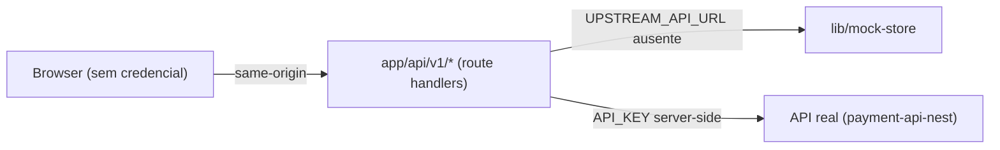

# Fase 6 — BFF e credenciais server-side

## Contexto / Objetivo

Até a fase 5 o browser recebia a credencial do parceiro (`NEXT_PUBLIC_API_KEY`) e o
segredo de webhook (`NEXT_PUBLIC_WEBHOOK_SECRET`) embutidos no bundle. Qualquer
visitante podia ler a chave no DevTools e chamar a API direto.

Esta fase promove `app/api/v1/*` a **BFF**: o browser fala same-origin sem
credencial nenhuma, e o route handler decide entre o mock em processo e a API
real, injetando `API_KEY` no servidor.



## Endpoints

| Método | Rota | Auth | Descrição |
|--------|------|------|-----------|
| GET | `/api/v1/payments` | same-origin | Proxy da listagem |
| POST | `/api/v1/payments` | same-origin | Proxy da criação |
| GET | `/api/v1/payments/{id}` | same-origin | Proxy do detalhe |
| GET/POST | `/api/v1/payments/{id}/splits` | same-origin | Proxy dos splits |
| POST | `/api/v1/webhooks/payment` | HMAC | Entrega do provedor |
| POST | `/api/simulator/fire` | `ENABLE_SIMULATOR` | Assina o evento e entrega |

## Request / Response

```json
// request — POST /api/simulator/fire (browser, sem assinatura nem segredo)
{
  "event_id": "evt_1",
  "provider": "fake_pix",
  "type": "payment.paid",
  "payment_id": "…",
  "occurred_at": "2026-08-26T12:00:00.000Z",
  "data": { "amount": 1500, "currency": "BRL" }
}
```

```json
// response — repassa a resposta do webhook
{ "accepted": true, "duplicate": false }
```

## Fluxo (passo a passo)

1. O browser chama `/api/v1/...` sem `Authorization`.
2. O handler lê `UPSTREAM_API_URL`. Vazio → responde pelo `lib/mock-store`.
3. Preenchido → repassa a requisição com `Authorization: Bearer ${API_KEY}` e
   devolve status e corpo do upstream, sem repassar headers de credencial.
4. No simulador, o browser posta o evento **sem assinatura**; o servidor serializa,
   assina com `WEBHOOK_SECRET` e entrega em `POST /webhooks/payment`.
5. O endpoint de webhook valida o HMAC com comparação timing-safe.

## Códigos de erro

| Código | Situação |
|--------|----------|
| 401 | Assinatura de webhook ausente ou inválida |
| 404 | `/api/simulator/fire` com `ENABLE_SIMULATOR` desligado |
| 502 | Upstream inalcançável a partir do BFF |

## Critérios de aceite

- [x] Nenhuma variável `NEXT_PUBLIC_API_KEY` / `NEXT_PUBLIC_WEBHOOK_SECRET` no repo
- [x] `lib/api.ts` não envia `Authorization` e usa base fixa same-origin `/api/v1`
- [x] `lib/webhook-sign.ts` (assinatura no browser) removido
- [x] BFF injeta `API_KEY` ao falar com o upstream e nunca devolve a chave ao browser
- [x] `/api/simulator/fire` assina server-side e respeita `ENABLE_SIMULATOR`
- [x] Bundle cliente não contém a chave nem o segredo

## Testes obrigatórios

- [x] `tests/bff.test.ts` — proxy envia a chave ao upstream e não a devolve ao browser
- [x] `tests/bff.test.ts` — fire assina com `WEBHOOK_SECRET` e é 404 com a flag off
- [x] `tests/client-secrets.test.ts` — fontes de cliente sem `process.env` de segredo
- [x] `scripts/check-client-bundle.sh` — `.next/static` sem chave/segredo
- [x] Playwright: checkout → webhook → success continua verde

## UI / rotas

| Rota | Tipo | Descrição |
|------|------|-----------|
| `/api/simulator/fire` | Route handler | Assinatura HMAC server-side |

## Variáveis de ambiente novas

| Var | Default | Descrição |
|-----|---------|-----------|
| `API_KEY` | `demo-partner-key` | Credencial do parceiro, só no servidor |
| `WEBHOOK_SECRET` | `dev-webhook-secret` | Segredo HMAC, só no servidor |
| `UPSTREAM_API_URL` | _(vazio)_ | API real; vazio usa o mock em processo |

Removidas: `NEXT_PUBLIC_API_KEY`, `NEXT_PUBLIC_WEBHOOK_SECRET`,
`NEXT_PUBLIC_API_BASE_URL` (o browser agora é sempre same-origin).

## Dependências / Rollback

- Dependências: fase 4 (simulador) e fase 5 (deploy/env).
- Rollback: reverter os route handlers para o mock direto e voltar a expor a chave
  no cliente — só aceitável em demo local.
