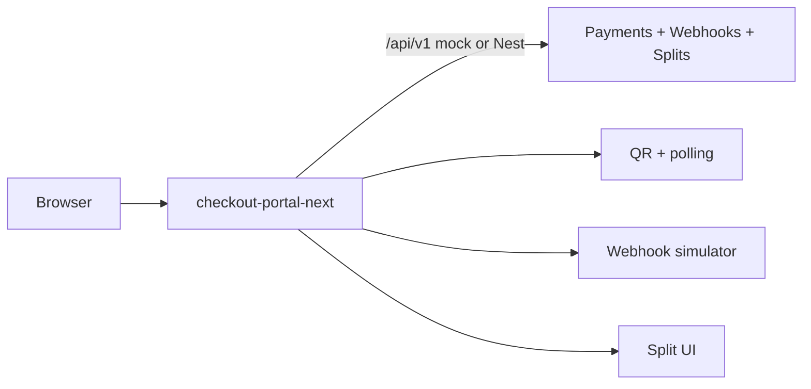

# AcmePay Checkout Portal (Next.js 15)

PIX cash-in checkout for the **AcmePay** portfolio ecosystem. Shares the same
HTTP contract as `payment-api-nest` and `pix-wallet-api`.

## Architecture



## Quickstart

```bash
cp .env.example .env.local
npm install
npm run dev
```

Open http://localhost:3000 — mock API is on `/api/v1`.

Point at Nest:

```bash
NEXT_PUBLIC_API_BASE_URL=http://localhost:3001/v1 npm run dev
```

## Demo routes

| Route | Purpose |
|-------|---------|
| `/` | Server-rendered payment list |
| `/checkout` | Create PIX + QR + poll → success/expired |
| `/checkout/success` | Paid confirmation |
| `/checkout/expired` | Expired QR |
| `/splits` | Platform / seller / affiliate rateio |
| `/simulator` | Fire signed webhooks (incl. duplicate `1042`) |

## Quality

```bash
npm run lint
npm run build
npx playwright install chromium   # once
npm run test:e2e
```

## Deploy (Vercel)

`vercel.json` sets the Next.js framework. Env for production mock:

- `NEXT_PUBLIC_API_BASE_URL=/api/v1`
- `NEXT_PUBLIC_API_KEY=demo-partner-key`
- `WEBHOOK_SECRET` / `NEXT_PUBLIC_WEBHOOK_SECRET`

## Docs

See `AGENTS.md` and `Docs/specs/` for the phase specs and contract.
